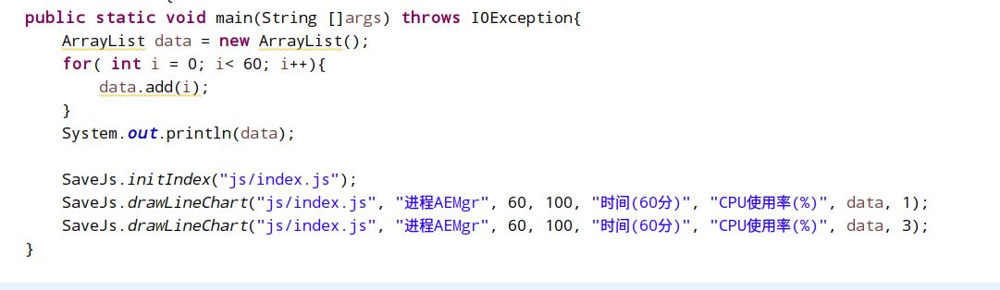
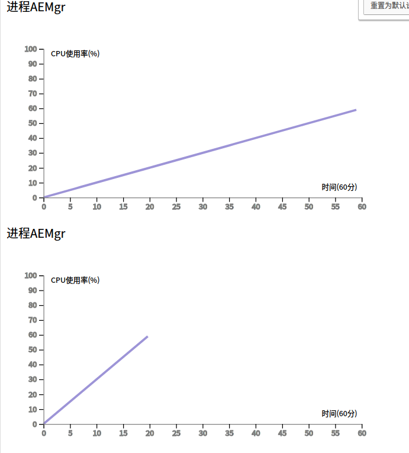

# function-lineChart
使用Java输出js文件绘制折线图,使用D3可视化库
>之后可能会更新到[我的博客](cugxuan.coding.me)时间不定,文章末尾有图片展示

## 前言
原本打算绘制曲线图,但是在D3的曲线拟合里面找了一些没有找到比较好用的.
对数据的表达不精确,最后还是使用了折线图,主要是js的函数,java只是输出
>从慕课网教程而来
http://www.imooc.com/video/4740

## Js函数
主要是把D3的js绘制lineChart的功能进行了一点封装,方便数据显示使用
函数调用例子,文件名为inde.js文件,需要在html文件中包含D3库,其[官网链接](https://d3js.org/)
```
<script src="https://d3js.org/d3.v4.js"></script>
<!-- 绘图的内容在index.js中，使用D3可视化库进行实现 -->
<script src="js/index.js"></script>
```
调用方法的example:
```
var data = [1,3,4,6,7,8]
var xRange=60,
	yRange=100,
	name='<p>进程AEMgr</p>',
    xText='时间(60分)',
	yText='CPU使用率(%)',
	scaleN=1;    //每个x单位有几个值
draw(name,xRange,yRange,xText,yText,data,scaleN);
```
## Java函数
将画图的内容封装在了src的SaveJs类中
需要先初始化,然后调用,example
```
SaveJs.initIndex("js/index.js");
SaveJs.drawLineChart("js/index.js", "进程AEMgr", 60, 100, "时间(60分)", "CPU使用率(%)", data, 1);
SaveJs.drawLineChart("js/index.js", "进程AEMgr", 60, 100, "时间(60分)", "CPU使用率(%)", data, 3);
```

## 在demo中可以进行调用
src
   - demo.java
   - SaveJs.java


